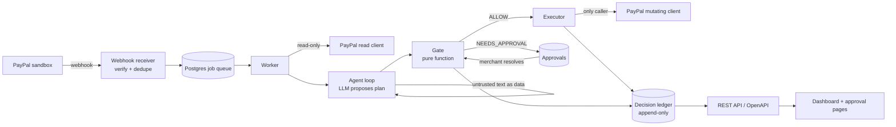

# Architecture

## Flow and trust boundaries

- **Untrusted:** webhook payloads until verified, buyer messages, any PayPal free-text fields.
- **Semi-trusted:** LLM output (schema-validated, then still gated).
- **Trusted:** gate, executor, charter, ledger.

## Components
- `agent/app/webhooks.py`: signature verification, dedupe, enqueue; responds fast.
- `agent/app/worker.py`: claims jobs (`FOR UPDATE SKIP LOCKED`, lease with expiry), runs the agent loop, reconciler.
- `agent/app/paypal/`: `read_client.py` (GET), `mutating_client.py` (executor only), `models.py` (pydantic), token cache.
- `agent/app/policy/`: `charter.py`, `rules.py`, `gate.py`.
- `agent/app/agent/`: `loop.py`, `prompts.py`, `schemas.py`, LLM interface, scenario cache.
- `agent/app/executor/`: write-ahead executor (see `plan/05-resilience.md`).
- `agent/app/ledger/`, `store_mock/`, `simulator/`, `api/`.
- `web/`: React app: AG Studio dashboard, detail, approval, demo pages; typed client generated from OpenAPI.

## Why a Postgres queue (ADR-004)
One datastore on Render, transactional enqueue with the webhook dedupe insert, no Redis/Celery to operate. Throughput needs here are tiny.

## Schema sketch
| Table | Key points |
|---|---|
| `webhook_events` | PK = PayPal event id; `transmission_id` unique; raw payload; `verified` |
| `jobs` | kind, dispute_id, status, attempts, `run_after`, `locked_until` |
| `disputes` | PayPal id PK; `state_fingerprint`; snapshot jsonb; denormalized status/reason/amount/due |
| `charters` | versioned per merchant; decisions store the version used |
| `agent_runs` | model, prompt_version, input hash, plan jsonb, cache_hit, error |
| `decisions` | **append-only** (trigger); action, verdict, rule_id, reason, also_triggered, fingerprint, charter_version |
| `executions` | `decision_id` UNIQUE; status INTENDED/SENT/CONFIRMED/FAILED; request hash; debug id |
| `approvals` | decision_id, token hash, payload hash, expires_at, resolution, edited payload |
| `orders`, `tracking_events`, `evidence_files` | mock store and uploaded evidence |
A hash chain over `decisions` is optional; only claim "tamper-evident" if it is implemented and tested.

## Tech choices
FastAPI · httpx · pydantic v2 · SQLAlchemy 2 + Alembic · structlog · Postgres · React + AG Studio (web framework pending ADR-005) · Render. Thin custom tool loop instead of an agent framework for determinism and explainability.
